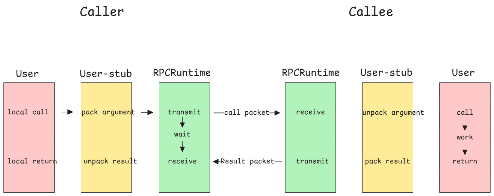

## MpRPC分布式网络通信框架项目
### 技术栈
- 集群和分布式概念以及原理
- RPC远程过程调用原理以及实现
- Protobuf数据序列化和反序列化协议
- Zookeeper分布式一致性协调服务引用以及编程
- muduo网络库编程
- conf配置文件读取
- 异步日志
- CMake构建项目继承编译环境

## 集群和分布式
- 集群：每一台服务器独立运行一个工程的所有模块
- 分布式：一个工程拆分了很多模块，每一个模块独立部署运行一个服务器主机上，所有服务器协同工作共同提供服务，每一台服务器称做分布式的一个节点，根据节点的并发要求，对一个节点可以再做节点模块集群部署。

## RPC通信原理
RPC (Remote Procedure Call Protocol) 远程过程调用协议

- 黄色部分：设计rpc方法参数的打包和解析，也就是数据的序列化和反序列化，使用Protobuf
- 绿色部分；网络部分，包括寻找rpc服务主机，发起rpc调用请求和相应rpc调用结果，使用muduo网络库和zookeeper服务配置中（专门做服务发现）
- mprpc框架主要包含以上两个部分的内容

## 环境配置使用
#### 项目代码工程目录
- bin：可执行文件
- build：项目编译文件
- lib：项目库文件
- src：源文件
- test：测试代码
- example：框架代码使用规范
- CMakeLists.txt：顶层的cmake文件
- README.md：项目自述文件
- autobuild.sh：一键编译脚本

## 网络IO模型介绍
**accept + read/write**
不是并发服务器

**accept + fork - process-pre-connection**
适合并发链接数不大，计算任务工作量大于fork的开销

**accept + thread thread-pre-connection**
比方案2的开销小了一点，但是并发造成线程堆积过多

**muduo的时间：reactors in threads - one loop per thread**
方案的特点是one loop per thread，有一个main reacotr（I/O）负载accept链接，然后把链接分发到某个sub reactor（Worker），该链接的所用操作都在那个sub reactor所处的线程中完成，多个连接可能被分配到多个线程中，以充分利用CPU。
如果有过多的耗费CPU I/O计算任务，可以创建新的线程专门处理耗时的计算任务。

**reacotrs in process - one loop pre process**
nginx服务器的网络模块设置，基于进程设计，采用多个Reactors充当IO进程和工作进程，通过一把accept锁，完美解决多个Reactors“惊群现象”。
